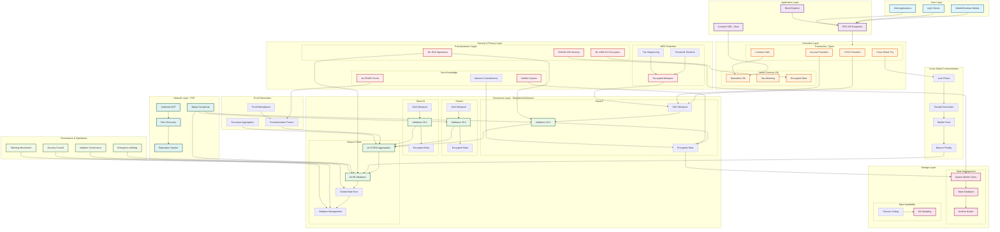

```mermaid
graph TB
    subgraph "User Layer"
        Wallet[Mobile/Desktop Wallets]
        LightClient[Light Clients]
        WebApp[Web Applications]
    end

    subgraph "Application Layer"
        SDK[Contract SDK - Rust]
        API[RPC API Endpoints]
        Explorer[Block Explorer]
    end

    subgraph "Execution Layer"
        subgraph "Smart Contract VM"
            WASM[Wasmtime VM]
            Gas[Gas Metering]
            Privacy[Encrypted State]
        end
        
        subgraph "Transaction_Types"
            UTXO[UTXO Transfers]
            Account[Account Transfers]
            Contract[Contract Calls]
            CrossShard[Cross-Shard Txs]
        end
    end

    subgraph "Consensus Layer - Sharded Architecture"
        subgraph "Shard 0"
            S0_Val[Validators 3f+1]
            S0_State[Encrypted State]
            S0_Mempool[DAG Mempool]
        end
        
        subgraph "Shard 1"
            S1_Val[Validators 3f+1]
            S1_State[Encrypted State]
            S1_Mempool[DAG Mempool]
        end
        
        subgraph "Shard N"
            SN_Val[Validators 3f+1]
            SN_State[Encrypted State]
            SN_Mempool[DAG Mempool]
        end
        
        subgraph "Beacon Chain"
            BeaconVal[64-96 Validators]
            BeaconState[Global State Root]
            zkAgg[zk-STARK Aggregation]
            ValidatorMgmt[Validator Management]
        end
    end

    subgraph "Cross-Shard Communication"
        XS_Lock[Lock Phase]
        XS_Receipt[Receipt Generation]
        XS_Proof[Merkle Proof]
        XS_Finality[Beacon Finality]
    end

    subgraph "Security & Privacy Layer"
        subgraph "Post-Quantum Crypto"
            MLKEM[ML-KEM-512 Encryption]
            MLDSA[ML-DSA Signatures]
            SHAKE[SHAKE-256 Hashing]
        end
        
        subgraph "Zero-Knowledge"
            STARK[zk-STARK Proofs]
            Nullifiers[Nullifier System]
            Commitments[Balance Commitments]
        end
        
        subgraph "MEV Protection"
            EncMempool[Encrypted Mempool]
            Timelock[Threshold Timelock]
            FSS[Fair Sequencing]
        end
    end

    subgraph "Network Layer - P2P"
        GossipSub[libp2p GossipSub]
        DHT[Kademlia DHT]
        Discovery[Peer Discovery]
        Reputation[Reputation System]
    end

    subgraph "Storage Layer"
        subgraph "State Management"
            SMT[Sparse Merkle Trees]
            StateDB[State Database]
            Archive[Archive Nodes]
        end
        
        subgraph "Data Availability"
            ErasureCoding[Erasure Coding]
            DAN[DA Sampling]
        end
    end

    subgraph "Proof Generation"
        Provers[Permissionless Provers]
        ProofMarket[Proof Marketplace]
        Recursive[Recursive Aggregation]
    end

    subgraph "Governance & Operations"
        EmergencyMS[Emergency Multisig]
        SecurityCouncil[Security Council]
        ValidatorGov[Validator Governance]
        Slashing[Slashing Mechanism]
    end

    %% User Layer Connections
    Wallet --> API
    LightClient --> API
    WebApp --> API
    
    %% Application to Execution
    SDK --> WASM
    API --> Transaction_Types
    Explorer --> API
    
    %% Execution to Consensus
    UTXO --> S0_Mempool
    Account --> S0_Mempool
    Contract --> WASM
    CrossShard --> XS_Lock
    
    %% Shard Consensus
    S0_Mempool --> S0_Val
    S1_Mempool --> S1_Val
    SN_Mempool --> SN_Val
    
    S0_Val --> S0_State
    S1_Val --> S1_State
    SN_Val --> SN_State
    
    %% Shard to Beacon
    S0_Val --> zkAgg
    S1_Val --> zkAgg
    SN_Val --> zkAgg
    
    zkAgg --> BeaconVal
    BeaconVal --> BeaconState
    BeaconState --> ValidatorMgmt
    
    %% Cross-Shard Flow
    XS_Lock --> XS_Receipt
    XS_Receipt --> XS_Proof
    XS_Proof --> XS_Finality
    XS_Finality --> BeaconVal
    
    %% Security Integration
    MLKEM --> Privacy
    MLDSA --> S0_Val
    MLDSA --> BeaconVal
    SHAKE --> SMT
    
    STARK --> Provers
    Provers --> zkAgg
    Nullifiers --> S0_State
    Commitments --> S0_State
    
    EncMempool --> S0_Mempool
    Timelock --> EncMempool
    FSS --> EncMempool
    
    %% Network Layer
    GossipSub --> S0_Val
    GossipSub --> S1_Val
    GossipSub --> BeaconVal
    DHT --> Discovery
    Discovery --> Reputation
    
    %% Storage
    S0_State --> SMT
    SMT --> StateDB
    StateDB --> Archive
    ErasureCoding --> DAN
    
    %% Governance
    EmergencyMS --> BeaconVal
    SecurityCouncil --> ValidatorMgmt
    ValidatorGov --> BeaconState
    Slashing --> ValidatorMgmt
    
    %% Proof Market
    ProofMarket --> Provers
    Recursive --> zkAgg

    classDef userClass fill:#e1f5ff,stroke:#01579b,stroke-width:2px
    classDef appClass fill:#f3e5f5,stroke:#4a148c,stroke-width:2px
    classDef execClass fill:#fff3e0,stroke:#e65100,stroke-width:2px
    classDef consensusClass fill:#e8f5e9,stroke:#1b5e20,stroke-width:2px
    classDef securityClass fill:#ffebee,stroke:#b71c1c,stroke-width:2px
    classDef networkClass fill:#e0f2f1,stroke:#004d40,stroke-width:2px
    classDef storageClass fill:#fce4ec,stroke:#880e4f,stroke-width:2px
    classDef govClass fill:#f1f8e9,stroke:#33691e,stroke-width:2px
    
    class Wallet,LightClient,WebApp userClass
    class SDK,API,Explorer appClass
    class WASM,Gas,Privacy,UTXO,Account,Contract,CrossShard execClass
    class S0_Val,S1_Val,SN_Val,BeaconVal,zkAgg consensusClass
    class MLKEM,MLDSA,SHAKE,STARK,Nullifiers,EncMempool securityClass
    class GossipSub,DHT,Discovery,Reputation networkClass
    class SMT,StateDB,Archive,DAN storageClass
    class EmergencyMS,SecurityCouncil,ValidatorGov,Slashing govClass
```